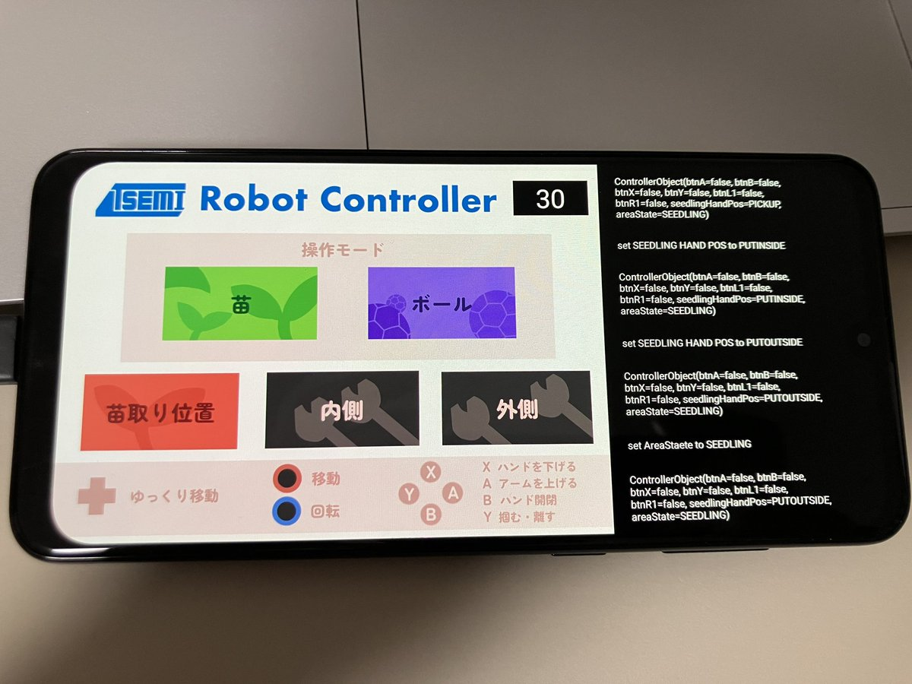

# NHK2024_R1_Smartphone_Controller

## UI

## 実装方法
Android studioを使って、Kotolinで実装しました.
他の大学を見ていると、ロボットでサーバーを立てて、`http://ipアドレス:ポート`でアクセスしてコントローラにしているところもありました。今後、ロボットの自己位置などのデータをリアルタイムで画面上に表示したい場合はロボット側にサーバーを立てる方が楽かと思われます.

ラズパイ側で禁止処理の実装を簡単にするために、足回りと足回り以外の通信をポートを分けることで完全に別にしています。禁止処理の内容は[issue](https://github.com/T-semi-Tohoku-Uni/NHK2024_R1_Raspi/issues/6)にメモしています。どのような状況下でも足回りだけは動かすことができるので、別で通信した方が楽に実装できるかなというお気持ちです。

コントローラーのスティックの情報をそのまま`soket.send`を使って送ると、高レートで送っている理由なのか、データに欠損が出る（全てのパケットが送られない）ということがあったので、`RaspiRepository`というクラスを作成しました。
使い方は
- `MainActivity`内でインスタンス化する
- `startRaspiUDP`メソッドを呼び出し、通信の初期化を行う（ここで、スレッドを二つ作成します）
- `MainActivity`内でデータを送りたい時は、`sendWheelDataToRaspi`の引数にデータを入れて呼び出します
- あとは勝手にデータが送られます
queueを使ってうまいこと処理することでデータの欠損が出る問題を解消できました（特に不具合はなかったように思います）

実装箇所

https://github.com/T-semi-Tohoku-Uni/NHK2024_R1_Smartphone_Controller/blob/78b04862a0cf86daa0f06443369f67aaea586dfc/app/src/main/java/com/example/nhk2024_r1_smartphone_controller/MainActivity.kt#L40

https://github.com/T-semi-Tohoku-Uni/NHK2024_R1_Smartphone_Controller/blob/78b04862a0cf86daa0f06443369f67aaea586dfc/app/src/main/java/com/example/nhk2024_r1_smartphone_controller/MainActivity.kt#L102

https://github.com/T-semi-Tohoku-Uni/NHK2024_R1_Smartphone_Controller/blob/78b04862a0cf86daa0f06443369f67aaea586dfc/app/src/main/java/com/example/nhk2024_r1_smartphone_controller/MainActivity.kt#L263

## 実行環境
- スマホ：Samsung Galaxy A30
- コントローラー： GAMESIRX2TYPEC
- Android studio : 2021.3.1 Patch 1

## 実行方法
Android studioをインストールして、実機のスマホをパソコンに接続。書き込んだら使えるようになるよ。